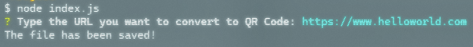
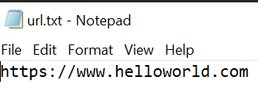

# QR Code Generator

## Description
This Node.js application generates a QR code from a user-provided URL and saves both the QR code image and the URL to files. It demonstrates the use of npm packages, asynchronous programming, and file system operations in Node.js.

## Features
- Command-line interface for URL input
- URL validation for security and format correctness
- QR code generation from valid URLs
- Saving QR code as a PNG image
- Saving the input URL to a text file
- All generated files are stored in a dedicated 'QR_Codes' directory

## Installation
1. Ensure you have Node.js installed on your system:
[Node.js](https://nodejs.org/)
2. Clone this repository
3. In terminal, navigate to the project directory
4. Install the required node modules:

[@inquirer/prompts](https://www.npmjs.com/package/@inquirer/prompts)
```sh
npm i @inquirer/prompts
```
[qr-image](https://www.npmjs.com/package/qr-image)
```sh
npm i qr-image
```

## Usage
In terminal, run the application using Node.js:
```sh
node index.js
```

Follow the prompts to enter a URL. The application will generate a QR code and save it along with the URL in the current directory.





## Dependencies
- @inquirer/prompts (external module): For handling user input
- qr-image (external module): For generating QR codes
- fs (core Node.js module): For file system operations
- url (core Node.js module): For URL parsing and validation

## File Structure
- `index.js`: Main application file
  - `url.png`: Generated QR code image
  - `url.txt`: Text file containing the input URL

## Error Handling
The application includes error handling for:
- Invalid URL formats
- Disallowed characters in URLs
- File system operation errors

## License
[MIT License](https://choosealicense.com/licenses/mit/)

## Author
Crispen LeBlanc

## Acknowledgments
- Thanks to Dr. Angela Yu, lead developer and author of The Complete 2024 Web Development Bootcamp

